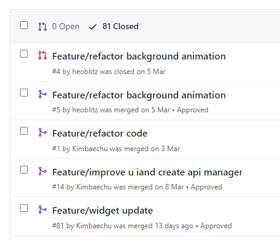
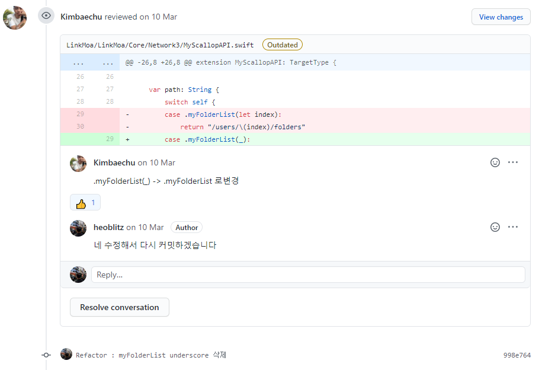
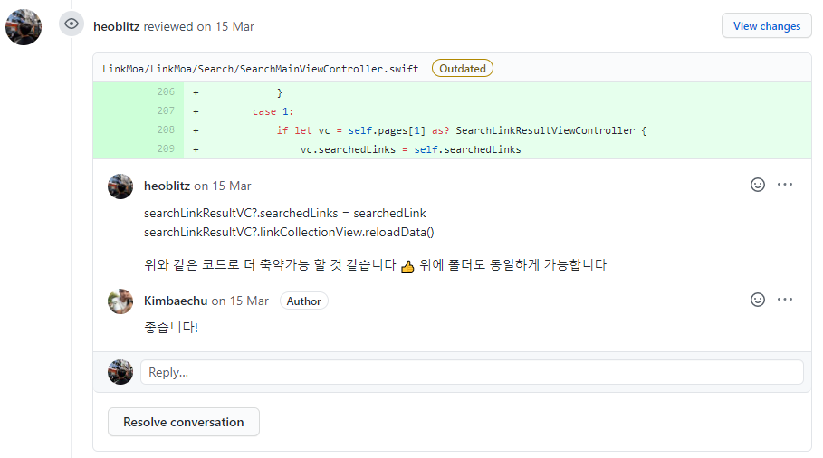
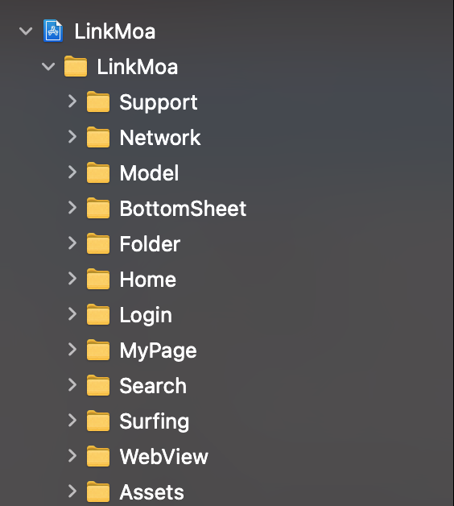

# 링크모아
나만의 링크달을 저장하고 관리하세요.

  

[](https://apps.apple.com/kr/app/%EB%A7%81%ED%81%AC%EB%AA%A8%EC%95%84-%EB%B6%81%EB%A7%88%ED%81%AC-%EA%B3%B5%EC%9C%A0-%EC%95%B1/id1559681268)

<br>

# 프로젝트 소개
링크모아는 소중한 링크들을 쉽게 찾아보고 정리할 수 있는 서비스입니다.   
다양한 주제에 맞게 링크를 정리하고 공유함으로써 지식을 쉽게 공유할 수 있습니다.

<br>

# iOS 개발 팀원
| 허원 🧑‍💻                                | 권범철 🧑‍💻                              |
| ------------------------------------------ | ---------------------------------------- |
| [@heoblitz](https://github.com/heoblitz) | [@Kimbaechu](https://github.com/Kimbaechu) |

<br>

# 프레임 워크
- UIKit
- SwiftUI
- WidgetKit

<br>

# 라이브러리
- Moya ( 네트워크 레이어 )
- Kanna ( meta data 파싱 )
- Kingfisher ( 이미지 캐싱 )
- Toast-Swift ( alert )
- RxSwift
- SwiftLint

<br>

# 아키텍처
- MVVM

<br>

# 데이터 바인딩 방식
- RxSwift

도입배경
복잡한 비동기 처리를 쉽게 처리한다는 장점 

MVVM에 적합한 처리방식

<br>

# 협업 방식

git-flow ( 코드 리뷰를 거친 PR 만 develop 브랜치에 반영 )  

앱 배포시에는 별도의 release 브랜치를 생성함 ( ex. release/1.0.1 )

  
  
  

<br>

# 목차

- [기능](#feature)
- [설계](#structure)
- [문제 해결](#problem_solving)
- [배운 점](#learned)

<br>
<br>

# 기능 <a id="feature"></a>
[시연 영상](https://www.youtube.com/watch?v=jVqwWEtFGM4)

<br>
<br>

# 설계 <a id="structure"></a>

## 폴더 구조

폴더 구조는 Context ( 주요 기능 ) 으로 구분했고,  
내부에서 MVVM 를 각각 나누었음

  
  
<br>
<br>

## 모델 설계
문자열 데이터 중 종류를 나타내는 값은 오타 등의 문제를 방지하지 위해 enum으로 표현

```swift
struct UsersFolder: Codable {
    let isSuccess: Bool
    ...

    struct Result: Codable {
        let index: Int
				...
        let type: FolderType
        ...

        enum CodingKeys: String, CodingKey {
            case index = "folderIdx"
            ...
        }
    }
    
    enum FolderType: String, Codable {
        case privateFolder = "private"
        case publicFolder = "public"
    }
}
```

<br>

## 뷰모델 설계
ViewModel의 Input과 Output을 구분하여 사용.  
Input은 Replay가 필요없고 state보다 event가 어울리기 때문에 Signal을 사용함
Output은 UI에 필요하고 state의 성격이 필요하기 때문에 Driver를 주로 사

```swift
final class SurfingViewModel: ViewModelType {

    struct Input {
        let fetchTopTenFolders: Signal<Void>
        let fetchLikedFolders: Signal<Void>
    }
    
    struct Output {
        var sections: Driver<[SurfingSectionModel]>
        var errorMessage: Signal<String>
    }
    
    private let networkManager = RxSurfingManager()
    private let disposeBag = DisposeBag()
    private let errorMessage: PublishRelay<String> = PublishRelay()
    
    func transform(input: Input) -> Output {
       ...
        return Output(sections: sections.asDriver(), errorMessage: errorMessage.asSignal())
    }
}
```

<br>
<br>

# 문제 해결 <a id="problem_solving"></a>

## share extension memory issue ( 허원 )
- 문제점  
사파리에서 공유 버튼을 누르고, 폴더 선택 VC 로 접근하면 앱이 죽는 문제  
share extension 의 메모리 제한은 대략 15MB 정도

- 해결  
GIF 기능을 제한하는 별도의 파라미터를 update 메서드에 추가함  
메인 앱에서는 GIF 를 지원하고, share extension 에서는 예외 처리 하도록 구성

<br>

## custom bottom alert view ( 허원 )
- 문제점  
UX 특성 상 아래에서 올라오는 custom bottom alert 가 많았음.  
기존에는 사용되는 VC 마다 present 메서드를 일일히 추가했었는데, 코드 중복성이
매우 증가되었음.

- 해결  
extension 으로 메서드를 모든 VC 에 추가하는 방식은 비효율적이라고 판단함  
따라서 최대한 POP 방식을 충족하기 위해 Where Self 구문을 사용하였음.  
CustomAlert 라는 Protocol 을 구현하였고, 필요한 VC 만 채택하여 사용할 수 있도록 함

<br>

## hide category View  ( 범철 )
- 문제점  
스크롤을 내리면 카테고리가 사라지고 스크롤 위치에 상관없이 스크롤을 올리면 바로 카테고리가 나타나는 구조  
스크롤 뷰를 최상단과 최하단에서는 contentSize보다 더 올리고 내릴 수 있어서 예상하지 못한 레이아웃 깨짐 현상 발생

- 해결  
컨텐츠 높이와 스크롤뷰 높이, 컨텐츠오프셋을 log로 확인하면서 해결방법을 찾음  
컨텐츠높이 + 인셋  > 스크롤뷰높이 일 때만 제약이 바뀌도록 함

<br>

## Infinite Scroll Reload  ( 범철 )
- 문제점  
스크롤이 바닥에 도착하면 다음 데이터를 받아오는 구조  
마지막 페이지에서 스크롤 바닥에 도착하면 api를 여러번 호출하는 문제 발생

- 해결  
한 번에 20개씩 페이징처리하는데 이보다 적은 데이터를 받아올 경우  
마지막 페이지이므로 더이상 api 호출하지 않게 변경

<br>
<br>

# 배운 점 <a id="learned"></a>

iOS 개발의 협업 방식을 배웠고, 좋은 코드를 위해 같이 고민해가는 경험을 할 수 있었음 (허원)
- 구조, viewModel 구현 방식은 다른 뛰어난 프로젝트, 포스팅을 많이 참고했음 ( kickstarter, 카카오 개발자님 블로그 등)
- 코드 리뷰 과정을 통해 더 나은 코드를 작성할 수 있도록 같이 고민해보고 Apple 코딩 컨벤션을 충족하려 노력했음  
ex ) let dict: [String : String]   let dict: [String: String] 👍

<br>

내가 맡은 파트보다 프로젝트 전체를 고려하는 개발을 하게 되었음 (범철)

- 협업을 하면서 담당 파트가 아닌 부분도 검토하면서 중복을 줄임
- bottom alert view의 경우 약간의 UI와 로직만 변경하면 재사용할 수 있음
- 최초 동료가 만들어놓은 코드를 재사용이 가능하도록 리팩토링해서 재사용함
